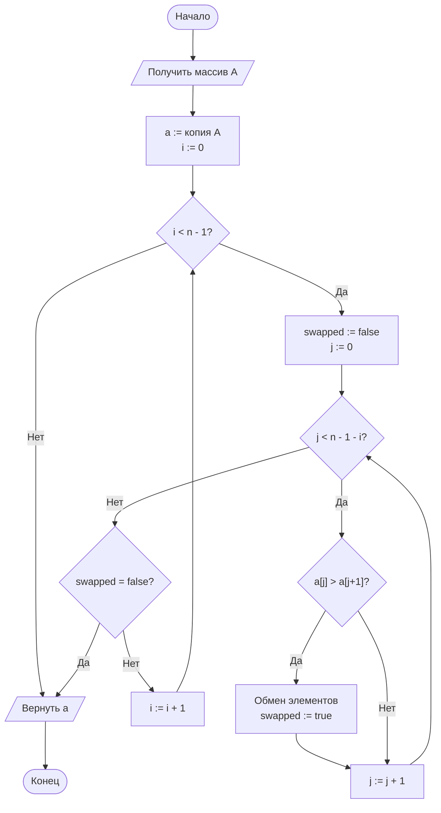

```mermaid
flowchart TD
    A([Начало]) --> B[/Получить массив A/]
    B --> C["a := копия A<br/>i := 0"]
    C --> D{"i < n - 1?"}
    D -- Нет --> Z[/Вернуть a/] --> E([Конец])
    D -- Да --> F["swapped := false<br/>j := 0"]
    F --> G{"j < n - 1 - i?"}
    G -- Нет --> H{"swapped = false?"}
    H -- Да --> Z
    H -- Нет --> I["i := i + 1"] --> D
    G -- Да --> J{"a[j] > a[j+1]?"}
    J -- Да --> K["Обмен элементов<br/>swapped := true"] --> L["j := j + 1"] --> G
    J -- Нет --> L
```