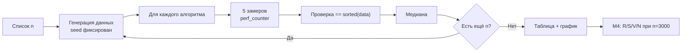

```mermaid
flowchart LR
    A["Список n"] --> B["Генерация данных<br/>seed фиксирован"]
    B --> C["Для каждого алгоритма"]
    C --> D["5 замеров<br/>perf_counter"]
    D --> E["Проверка == sorted(data)"]
    E --> F["Медиана"]
    F --> G{"Есть ещё n?"}
    G -- Да --> B
    G -- Нет --> H["Таблица + график"]
    H --> I["М4: R/S/V/N при n=3000"]
```