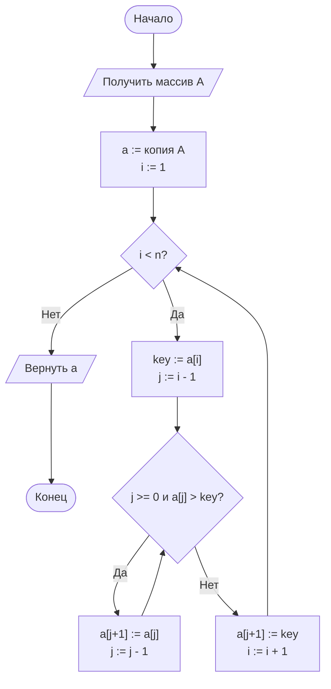

```mermaid
flowchart TD
    A([Начало]) --> B[/Получить массив A/]
    B --> C["a := копия A<br/>i := 1"]
    C --> D{"i < n?"}
    D -- Нет --> Z[/Вернуть a/] --> E([Конец])
    D -- Да --> F["key := a[i]<br/>j := i - 1"]
    F --> G{"j >= 0 и a[j] > key?"}
    G -- Да --> H["a[j+1] := a[j]<br/>j := j - 1"] --> G
    G -- Нет --> I["a[j+1] := key<br/>i := i + 1"] --> D
```